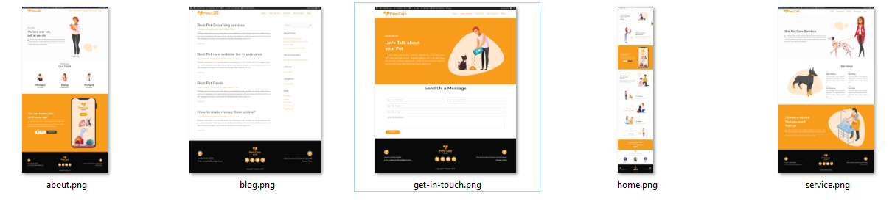

# WORDPRESS-DOCUMENTATION

Thanks for visiting my GitHub Account!

 **WordPress** is a web content management system. It was originally created as a tool to publish blogs but has evolved to support publishing other web content, including more traditional websites, mailing lists and Internet forum, media galleries, membership sites, learning management systems and online stores. [see-more](https://wordpress.com/)

## Source Code (Download)

[Click Here](https://mega.nz/folder/RGFiUApD#PoKIVCwF8IkQhE2PHw1XxQ)

## Required Software (Download)

- Bitnami-Wordpress ->[download](https://bitnami-wordpress-stack.software.informer.com/download/)

## Source Code (WordPress)

- [My Tutorial Website](https://mega.nz/file/BLdSQagR#fbCpPvNIau6d08Oh8lCxuqGsTdaPQXgdETRz5WGGLvE)
- [Blog Nature-Lover](https://mega.nz/file/hekVFTBa#nayjccv6COglvKLCR-d52iIXkV55QsOWjjhjIYVVuFU)
- [Business Finicix](https://mega.nz/file/Be8GjDIQ#WB0BU3Ckw_SuIu2yVURoLtaSopIuxGLwZzEElB-1bKs)
- [Pets Care](https://mega.nz/file/9KUnUBrZ#z3bG5j7IHkSbrF1hWY2UxZRqnapYj6gM5L2pzYe0FTY)
- [Blog-learn with fair](https://mega.nz/file/hDsTjZoY#olx1WdysrLWOKfea9dTOjDMlWsMYGTjXVRV-v7hUu9o)
- [PUST Clone](https://mega.nz/file/tH0FiZIK#FGdoFs8DUn-a1mMa__6phSXXXjlPQMFFbJWZvOqKFZg)
- [gjortt](https://mega.nz/file/5L91TKDD#lkPjkoRhiEQR4j_n_zpGcX9QV_sMdfF9cVQwmAoPOHc)

## Theme and Plugin (Download)

[Click Here](https://mega.nz/file/gCMHCJrS#ksQg5STxgJTYRGZ317Le1fcLuAgThsZuvbqpt47REco)

## All WordPress Documents (Download)

[Click Here](https://mega.nz/folder/hOkSVZxA#l69RG42cz8MZRjlu4XT-aQ)

## Project Screenshot

|                                                                                                     |
| :-------------------------------------------------------------------------------------------------: |
|                                     My-Tutorial-Website Demo-1                                      |
|        |
|                                     My-Tutorial-Website Demo-2                                      |
|        |
|                                          Blog-Nature-Lover                                          |
|        |
|                                          Business-Finicix                                           |
|    |
|                                              Pets Care                                              |
|                                                                   |
|                                           Learn-with-fair                                           |
|  |
|                                               Gjortt                                                |
|                    |

## Follow Me

 [Facebook](http://facebook.com/learnwithfair),  [Youtube](http://youtube.com/@learnwithfair),  [Instagram](http://instagram.com/learnwithfair)
